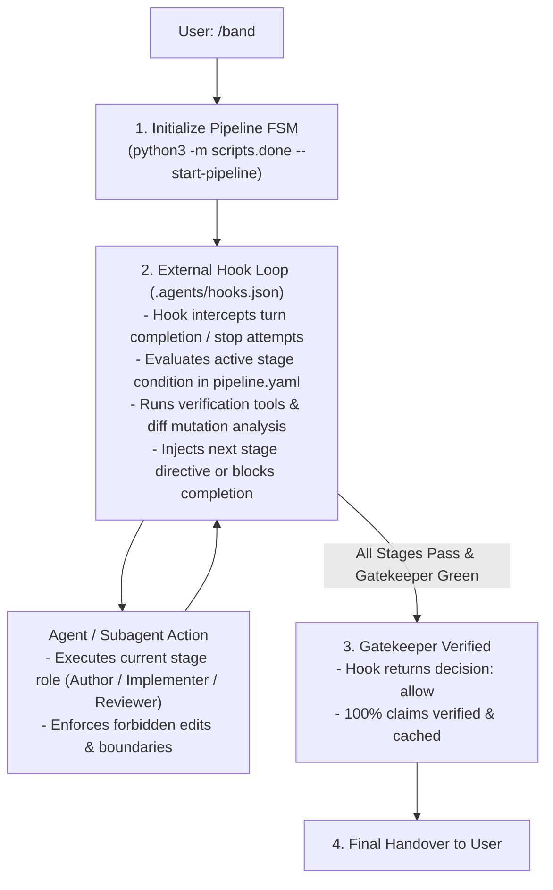

# Hook-Driven Multi-Agent Pipeline Orchestrator (`/band`)

The `/band` skill is a **deterministic, hook-driven workflow orchestrator**. Rather than relying solely on LLM prompt instructions that can be skipped or hallucinated, `/band` initializes the state machine (`state.json`), and the **external harness hook** (`python3 -m scripts.done --hook` in `.agents/hooks.json`) actively intercepts actions, runs deterministic checks, blocks premature stopping, and pushes the agent from stage to stage.



---

## 1. How the Hook Drives the Pipeline

1. **Activation**:
   When `/band` is invoked, start the pipeline for the active task:
   ```bash
   python3 -m scripts.done --start-pipeline
   ```
   This loads the configured pipeline profile (from `done.yaml` or `.agents/pipelines/`), creates `artifacts/state.json`, and outputs the initial stage directive.

2. **External Hook Enforcement (`.agents/hooks.json`)**:
   Every time the agent completes an action or attempts to finish a turn, the harness hook executes:
   ```bash
   python3 -m scripts.done --hook
   ```
   - **Blocks early exit**: Returns `{"decision": "continue", "reason": "..."}` if current stage requirements are unmet.
   - **Evaluates stage transitions**:
     - *Red Phase*: Proves tests exist and fail (Red) before allowing implementation.
     - *Green Phase*: Confirms test files were not modified and test suite turns Green.
     - *Mutation Gate*: Analyzes diff mutations, caches results (`state.json`), and extracts surviving mutants.
     - *Adversarial Review*: Directs reviewer to surviving mutants; routes fix loops until killed.
   - **Advances the FSM**: Updates `current_stage_idx` and provides the exact directive for the next subagent role.

3. **Final Gatekeeper & Completion**:
   When the final gatekeeper stage verifies all claims in `done.yaml`, the hook issues `{"decision": "allow"}` and marks the pipeline `status: "completed"`.

---

## 2. Dynamic Stage Execution Guidelines

When working within the pipeline directed by the hook:
- Follow the high-priority directive emitted by the hook for the active stage.
- For subagent stages: spawn specialized subagents (`invoke_subagent`) matching the stage's `role` and context.
- For tool verifications: let the hook and `scripts.done` run deterministic checks and leverage content-addressed caching.
- Check current status anytime with:
  ```bash
  python3 -m scripts.done --status
  ```
