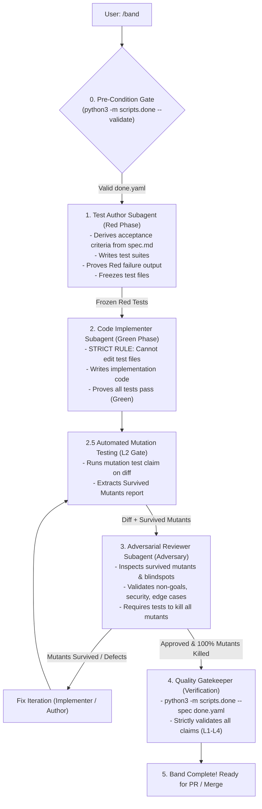

# Band Orchestrator Skill (`/band`)

The `/band` skill is the **automated multi-agent orchestrator** implementing the project's *Working in Bands* protocol ([`rules/process.md`](../../rules/process.md)). 

When triggered, the orchestrator autonomously coordinates specialized subagents and deterministic tools using `invoke_subagent` and `scripts.done` to enforce strict TDD phase separation, mutation killing, and role isolation without requiring manual handoffs.



---

## Phase 0: Pre-Condition Check & Contract Verification

Before spawning any subagent:
1. Locate `.agents/tasks/<slug>/done.yaml`.
2. Validate the manifest schema:
   ```bash
   python3 -m scripts.done --validate .agents/tasks/<slug>/done.yaml
   ```
3. **HARD STOP RULE:** If `done.yaml` or `spec.md` is missing or invalid, stop immediately and instruct the user to run `/intent` and `/spec`.

---

## Phase 1: Test Author Subagent (Red Phase)

The orchestrator invokes the **Test Author** subagent via `invoke_subagent`:

```json
{
  "TypeName": "self",
  "Role": "Test Author",
  "Prompt": "You are the Test Author subagent for task <slug>. Read .agents/tasks/<slug>/intent.md and .agents/tasks/<slug>/spec.md. Read rules/process.md.\n\nYour mandate:\n1. Derive acceptance criteria strictly from spec.md.\n2. Author the new/updated test files (*.spec.ts, *.e2e.spec.ts, or test suites).\n3. Execute the tests narrowly and PROVE that they FAIL with clean Red output (testing the expected absent capabilities).\n4. Freeze the test files and report back the exact list of written test files along with the Red test execution output.\n5. DO NOT write production implementation code."
}
```

**Orchestrator Action upon receiving response:**
- Record the list of frozen test files.
- Verify that the Red failure output accurately reflects missing features rather than compilation or syntax errors.

---

## Phase 2: Code Implementer Subagent (Green Phase)

The orchestrator invokes the **Code Implementer** subagent via `invoke_subagent`:

```json
{
  "TypeName": "self",
  "Role": "Code Implementer",
  "Prompt": "You are the Code Implementer subagent for task <slug>. Read .agents/tasks/<slug>/spec.md and coding style rules in rules/.\n\nYour input is the set of Red test files produced by the Test Author:\n<list of test files>\n\nSTRICT RULES:\n1. YOU ARE STRICTLY FORBIDDEN FROM EDITING THE TEST FILES. If a test appears malformed, report it to the orchestrator.\n2. Implement the minimal clean production code to turn all failing tests GREEN.\n3. Verify that all targeted tests pass.\n4. Re-export public components/types from barrel index files and apply localization strings where applicable.\n5. Report back the list of modified/created implementation files and the green test runner output."
}
```

**Orchestrator Action upon receiving response:**
- Verify that no test files were modified by the implementer.
- Confirm green test results.

---

## Phase 2.5: Automated Mutation Testing (L2 Mutant Run)

The orchestrator executes the mutation testing claim on the diff:
- Runs the mutation runner configured for the task workspace.
- Captures the mutation score and extracts all `[Survived]` mutants.

---

## Phase 3: Adversarial Reviewer Subagent (Adversary)

The orchestrator invokes the **Adversarial Reviewer** subagent via `invoke_subagent`, providing the diff and the mutation report:

```json
{
  "TypeName": "self",
  "Role": "Adversarial Reviewer",
  "Prompt": "You are the Adversarial Reviewer subagent for task <slug>. Read .agents/tasks/<slug>/intent.md, spec.md, and rules/process.md.\n\nHere is the Mutation Testing Report on the diff:\n<mutation output and survived mutants>\n\nYour mandate: Break the implementation.\n1. Analyze every survived mutant and identify why the test suite failed to catch it.\n2. Check adherence to intent.md: Were any Non-Goals violated? Are all Adversarial Mitigations implemented?\n3. Check multi-tenancy, data isolation, and boundary conditions.\n4. Check error handling: No empty catch blocks, no unhandled nulls/undefined, no temporary artifacts persisted.\n5. Report findings with concrete code pointers and failing experiments. If mutants survived or defects exist, specify the exact tests needed. If all mutants are killed and no blockers exist, return 'APPROVED'."
}
```

**Orchestrator Action upon receiving response:**
- If the reviewer reports defects or survived mutants, dispatch a fix iteration to the Code Implementer and Test Author.
- Repeat until 100% mutants are killed and Adversary returns `APPROVED`.

---

## Phase 4: Deterministic Quality Gate (Gatekeeper)

The orchestrator executes the full deterministic task verification harness:
```bash
python3 -m scripts.done --spec .agents/tasks/<slug>/done.yaml
```
Verify that all declared claims (L1 compilation & unit tests, L2 mutation score, L3 critic, L4 diff hygiene) return `PASSED`.

---

## Phase 5: Handover

Present a structured completion summary to the user with:
- List of created/updated test files (Red $\to$ Green proof).
- List of implemented production files.
- Mutation testing results (100% mutants killed).
- Results of the adversarial review and deterministic `scripts.done` quality gate.
