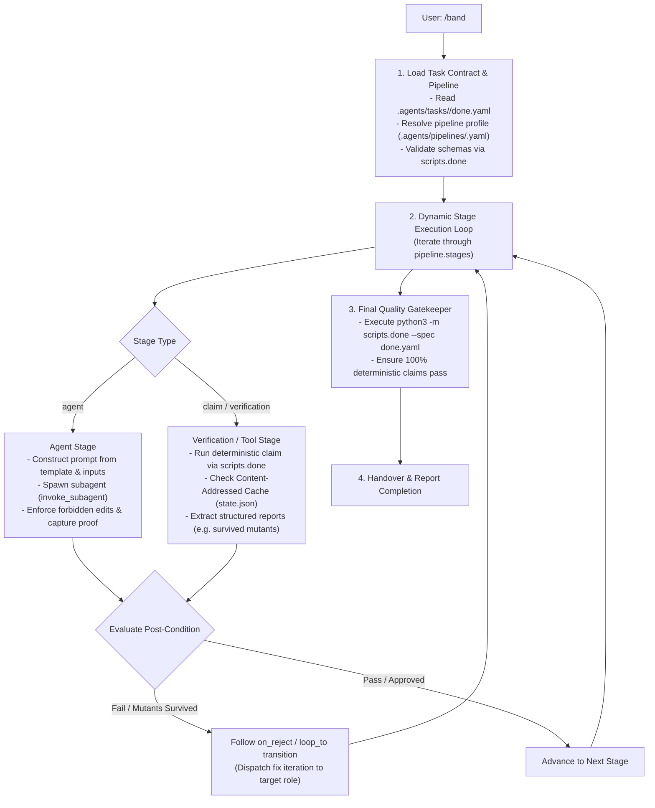

# Universal Multi-Agent Pipeline Orchestrator (`/band`)

The `/band` skill is a **universal, data-driven workflow orchestrator**. Rather than enforcing a rigid, hardcoded sequence of steps, `/band` reads the active task contract (`done.yaml`), loads the target pipeline configuration (`.agents/pipelines/<name>.yaml` or `.agents/pipeline.yaml`), and autonomously executes the declared stages (subagents, tool verifications, feedback loops, and deterministic quality gates).



---

## 1. Pipeline Resolution & Pre-Condition Validation

When `/band` is invoked:
1. Locate `.agents/tasks/<slug>/done.yaml` (or active task from argument/git branch).
2. Validate the `done.yaml` contract:
   ```bash
   python3 -m scripts.done --validate .agents/tasks/<slug>/done.yaml
   ```
   **HARD STOP RULE:** If `done.yaml` or `spec.md` is missing or invalid, stop immediately and instruct the user to complete `/intent` and `/spec`.
3. Resolve the pipeline definition:
   - Read the `pipeline:` field in `done.yaml` (e.g. `hardened`, `standard`, `fast`, `docs`, or a custom name).
   - Load the stage definition from `.agents/pipelines/<pipeline>.yaml`, `.agents/pipeline.yaml`, or built-in defaults.

---

## 2. Dynamic Stage Execution Engine

The orchestrator walks through each stage defined in `pipeline.stages`:

### A. Subagent Stages (`type: agent` or role-based definition)
1. **Context Assembly**: Gather the required inputs declared by the stage (e.g., `spec.md`, `intent.md`, modified files from prior stages, test outputs, or mutation reports).
2. **Subagent Invocation**: Call `invoke_subagent` with the stage's role and specialized prompt template:
   ```json
   {
     "TypeName": "self",
     "Role": "<stage.role>",
     "Prompt": "<dynamically interpolated prompt with task context, constraints, and inputs>"
   }
   ```
3. **Post-Condition & Boundary Enforcement**:
   - Verify that the subagent respected `forbid_edits` constraints (e.g., Implementers cannot modify test suites; Reviewers cannot modify production code).
   - Verify expected evidence in output (e.g. Red test failure proof, Green test passing proof, or explicit Review Approval).

### B. Tool / Verification Stages (`type: claim` or `type: harness`)
1. **Cache Lookup**: Harness checks `artifacts/state.json` for matching SHA256 composite fingerprint (`claim_id + params + git_diff_hash`).
   - If unchanged: **instant cache hit** (0.01s).
   - If changed: executes tool in isolated workspace runner.
2. **Structured Artifact Extraction**:
   - For mutation tools: parse surviving mutants (`[Survived]`) and pass them to downstream review stages.
   - For linter/test tools: parse failure traces and forward to repair loops.

### C. Feedback & Transition Routing
- If a review stage finds defects or a verification stage fails:
  - Check the stage's transition policy (`on_reject: loop_to(...)`).
  - Dispatch a targeted feedback prompt to the designated stage role (e.g. providing surviving mutants to the implementer/author to write killing assertions).
  - Repeat until stage invariants are satisfied.

---

## 3. Deterministic Gatekeeper Verification

Once all pipeline stages complete:
```bash
python3 -m scripts.done --spec .agents/tasks/<slug>/done.yaml
```
Verify that all declared quality claims across all tiers evaluate to `PASSED`.

---

## 4. Handover & Audit Log

Present a clean, structured completion summary to the user:
- Pipeline profile executed (e.g. `hardened`, `standard`, `fast`).
- Summary of executed stages and subagent contributions.
- Verification evidence (test runner output, mutation score, cache receipts).
- Confirmation of deterministic gatekeeper pass.
