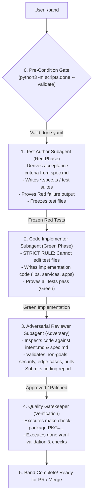

# Band Orchestrator Skill (`/band`)

The `/band` skill is the **automated multi-agent orchestrator** implementing the project's *Working in Bands* protocol ([`rules/process.md`](../../rules/process.md)). 

When triggered, the orchestrator autonomously dispatches specialized subagents using `invoke_subagent` to enforce strict TDD phase separation and role isolation without requiring manual handoffs.



---

## Phase 0: Pre-Condition Check & Contract Verification

Before spawning any subagent:
1. Locate `.agents/tasks/<slug>/done.yaml`.
2. Validate the manifest:
   ```bash
   python3 -m scripts.done --validate .agents/tasks/<slug>/done.yaml
   ```
3. **HARD STOP RULE:** If `done.yaml` or `spec.md` is missing or invalid, stop immediately and instruct the user to run `/intent` and `/spec`.

---

## Phase 1: Test Author Subagent (Red Phase)

The orchestrator invokes the **Test Author** subagent via `invoke_subagent`:

```json
{
  "TypeName": "self",
  "Role": "Test Author",
  "Prompt": "You are the Test Author subagent for task <slug>. Read .agents/tasks/<slug>/intent.md and .agents/tasks/<slug>/spec.md. Read rules/process.md.\n\nYour mandate:\n1. Derive acceptance criteria strictly from spec.md.\n2. Author the new/updated test files (*.spec.ts, *.e2e.spec.ts).\n3. Execute the tests narrowly (e.g. via vitest/jest) and PROVE that they FAIL with clean Red output (testing the expected absent capabilities).\n4. Freeze the test files and report back the exact list of written test files along with the Red test execution output.\n5. DO NOT write production implementation code."
}
```

**Orchestrator Action upon receiving response:**
- Record the list of frozen test files.
- Verify that the Red failure output accurately reflects missing features rather than compilation or syntax errors.

---

## Phase 2: Code Implementer Subagent (Green Phase)

The orchestrator invokes the **Code Implementer** subagent via `invoke_subagent`:

```json
{
  "TypeName": "self",
  "Role": "Code Implementer",
  "Prompt": "You are the Code Implementer subagent for task <slug>. Read .agents/tasks/<slug>/spec.md and rules/coding-style-frontend.md / rules/coding-style-backend.md.\n\nYour input is the set of Red test files produced by the Test Author:\n<list of test files>\n\nSTRICT RULES:\n1. YOU ARE STRICTLY FORBIDDEN FROM EDITING THE TEST FILES. If a test appears malformed, report it to the orchestrator.\n2. Implement the minimal clean production code in libs/, services/, or apps/ to turn all failing tests GREEN.\n3. Verify that all targeted tests pass.\n4. Re-export public components/types from barrel index.ts and apply i18n localization strings.\n5. Report back the list of modified/created implementation files and the green test runner output."
}
```

**Orchestrator Action upon receiving response:**
- Verify that no test files were modified by the implementer.
- Confirm green test results.

---

## Phase 3: Adversarial Reviewer Subagent (Adversary)

The orchestrator invokes the **Adversarial Reviewer** subagent via `invoke_subagent`:

```json
{
  "TypeName": "self",
  "Role": "Adversarial Reviewer",
  "Prompt": "You are the Adversarial Reviewer subagent for task <slug>. Read .agents/tasks/<slug>/intent.md, spec.md, and rules/process.md.\n\nYour mandate: Break the implementation.\n1. Check adherence to intent.md: Were any Non-Goals violated? Are all Adversarial Mitigations implemented?\n2. Check multi-tenancy and data isolation (e.g. school/organization scoping).\n3. Check error handling: No empty catch blocks, no unhandled nulls/undefined, no temporary blob URLs persisted.\n4. Report findings with concrete code pointers. If no blockers exist, return 'APPROVED'."
}
```

**Orchestrator Action upon receiving response:**
- If the reviewer reports defects, dispatch a fix iteration to the Code Implementer.
- If approved, proceed to Phase 4.

---

## Phase 4: Deterministic Quality Gate (Gatekeeper)

The orchestrator executes the package-level checks and verification claims:
1. Run target workspace checks:
   ```bash
   make check-package PKG=@vidya/<target-pkg>
   ```
2. Verify all claims declared in `.agents/tasks/<slug>/done.yaml`.

---

## Phase 5: Handover

Present a structured completion summary to the user with:
- List of created/updated test files (Red $\to$ Green proof).
- List of implemented production files.
- Results of the adversarial review and deterministic quality gate.
