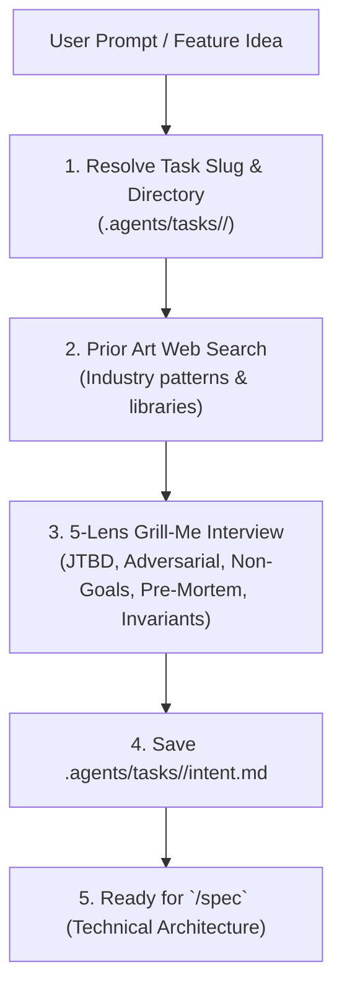

# Intent Skill (`/intent`)

The `/intent` skill is the **human-and-business layer** of task definition. Before discussing code, classes, or files, `/intent` clarifies **why** the task is needed, **what** problem it solves, and **what is strictly out of scope**.



---

## Step 1: Task Slug & Directory Resolution

1. Extract a clean, hyphenated slug from the user request (e.g. `feat-student-enroll`, `fix-sync-outbox`).
2. Create the task directory and its workspace subfolders:
   ```bash
   mkdir -p ".agents/tasks/<slug>/artifacts"
   mkdir -p ".agents/tasks/<slug>/scratch"
   ```

---

## Step 2: Prior Art Research (Web Search)

Before asking questions, search the web for how the problem is standardly solved in the industry:
1. Search for established patterns, open-source libraries, and known edge cases.
2. Note 3–5 sources and summarize standard solutions vs. known failure modes.

---

## Step 3: Interactive 5-Lens "Grill-Me" Interview

Execute an interactive Q&A with the user using the `ask_question` tool across **5 mandatory lenses**:

### 🔍 Lens 1: JTBD & 80/20 (Value & Simplicity)
- *What exact situation triggers this need for the user?*
- *What is the leanest 80/20 solution that delivers value without adding complex settings/modals?*
- *How will the user observe success?*

### 🔍 Lens 2: Adversarial & Edge Cases (Resilience)
- *What happens offline — when the device is disconnected or token is expired?*
- *What happens under race conditions (rapid double clicks, parallel syncing)?*
- *How does the system handle empty (`[]`, `""`), huge, or malformed data?*

### 🔍 Lens 3: Negative Requirements (Strict Non-Goals)
- *What related features, legacy code, or speculative scope are strictly **OUT OF SCOPE**?*
- *What must the agent NOT touch or rewrite?*

### 🔍 Lens 4: Pre-Mortem Simulation
- *Imagine this feature failed in production tomorrow: what was the root cause?*
- *What data migrations or backward compatibility risks exist?*

### 🔍 Lens 5: System Invariants
- *What critical system properties must NEVER break under any circumstances?*

---

## Step 4: Write `.agents/tasks/<slug>/intent.md`

Generate `.agents/tasks/<slug>/intent.md` following this standardized format:

```markdown
# Intent: <Title>

**Task Slug:** `<slug>`
**Date:** `<YYYY-MM-DD>`

## 1. Prior Art & Established Solutions
- Source 1: [Name](URL) — Takeaway
- Source 2: [Name](URL) — Takeaway

## 2. Problem & JTBD (The "Why")
- **Root Pain & Trigger:** ...
- **Target User & Scenario:** ...
- **Desired Outcome:** ...

## 3. Scope Boundaries & Strict Non-Goals
### In Scope (Goals):
- ...
### Strictly Out of Scope (Non-Goals):
- ...

## 4. Adversarial Failure Modes & Mitigations
| Failure Scenario | Impact | Required Mitigation |
| :--- | :--- | :--- |
| Offline / Network Drop | ... | ... |
| Concurrency / Race | ... | ... |

## 5. Invariants & Business Constraints
- Invariant 1: ...
- Invariant 2: ...
```

---

## Step 5: Hand Off to `/spec`
Inform the user that the intent is locked and ready for technical specification:
> *"Intent locked in `.agents/tasks/<slug>/intent.md`. Run `/spec` to generate the technical architecture and `done.yaml`."*
