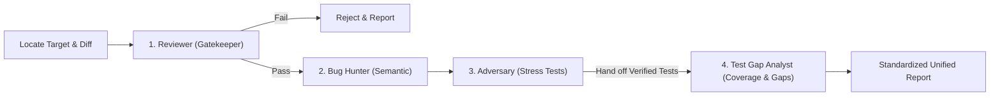

# Unified 4-Stage Code Review Pipeline (`/review`)

This skill orchestrates the complete, sequential 4-stage review pipeline defined in [`AGENTS.md`](../../../AGENTS.md). It automatically locates changed files, audits architecture and gatekeeper status, conducts deep semantic bug hunting, performs dynamic stress verification (retaining all verified tests permanently in the codebase), and conducts a systematic test gap analysis with coverage metrics and actionable test recommendations.



---

## Target & Repository Auto-Detection Protocol

When the user triggers `/review` (or `review`), resolve the repository root and determine the target:

1. **Repository Root Resolution**:
   - Determine `REPO_ROOT`:
     ```bash
     REPO_ROOT=$(git rev-parse --show-toplevel 2>/dev/null || readlink -f .agents/.. 2>/dev/null || echo "$PWD")
     ```
2. **Explicit Target Provided**:
   - If the user provides a path (e.g., `/review modules/libs/ui/src/diff`): focus the audit on those specific files.
   - If the user provides a git reference (e.g., `/review origin/main...HEAD` or commit SHA): review that diff range.
3. **Auto-Detection (Default)**:
   - Check uncommitted changes: `git -C "$REPO_ROOT" status --short` and `git -C "$REPO_ROOT" diff HEAD`.
   - If working tree is dirty: audit the uncommitted working tree diff.
   - If working tree is clean: find branch delta against base:
     ```bash
     BASE=$(git -C "$REPO_ROOT" merge-base HEAD origin/main 2>/dev/null || git -C "$REPO_ROOT" merge-base HEAD main 2>/dev/null || echo "HEAD~1")
     git -C "$REPO_ROOT" diff $BASE...HEAD
     ```
   - Summarize the detected review target and list of changed files before proceeding.

---

## Sequential Execution Stages

### Stage 1: Gatekeeper & Architectural Audit
*Reference: [`stages/1-gatekeeper.md`](./stages/1-gatekeeper.md)*

1. **Automated Gatekeeper**:
   ```bash
   make -C "$REPO_ROOT" check
   ```
   Audit the output:
   - Run the project gate (`make check`): type check, linter, formatter, tests.

2. **Fail-Fast Rule**:
   - If `make check` fails with syntax/type/lint errors, broken existing tests, or if `-race` was skipped due to missing dependencies: mark Gatekeeper as **FAIL**. Stop and reject immediately with exact error logs unless explicitly instructed to continue.
3. **Static Architecture Checklist**:
   - **Size Limits**: `<template>` <= 100 lines, `<script>` <= 300 lines, total <= 350 lines.
   - **Template Purity**: Zero nested ternaries, zero inline expressions in event handlers.
   - **Section Headers**: Props -> Events -> State -> Hooks -> Handlers -> Helpers.
   - **Type Extraction**: Props and emits extracted into adjacent `types.ts`.
   - **Styling discipline**: style definitions extracted where the style rule requires, not inlined.
   - **Service Layer Discipline**: No flat `api.ts`, no direct `fetch()`, domain services represent single bounded contexts.

---

### Stage 2: Semantic Logic & Blast Radius Audit
*Reference: [`stages/2-bughunter.md`](./stages/2-bughunter.md)*

1. **Blast Radius Mapping**:
   - Identify callers, upstream state sources, and downstream watchers/renderers.
2. **Defect Inspection Matrix**:
   - **Reactivity & state**: see the frontend conventions in [`../../rules/coding-style-frontend.md`](../../rules/coding-style-frontend.md).
   - **Concurrency & Races**: Out-of-order network responses, unmounted component mutations, unawaited promises outliving a request.
   - **Boundary & Null Errors**: Empty collections, single-element cases, and null vs. undefined under `strictNullChecks: false`, where the compiler will not catch them.
   - **Error Handling**: Swallowed exceptions, dirty UI state on rejected promises.
   - **Wire Contracts**: Missing nullable guards against Go `omitempty` fields.
3. **Formal Failure Scenarios**:
   - Every detected defect must be proven with a concrete scenario:
     *Given -> When -> Then*.

---

### Stage 3: Dynamic Stress Verification & Promoted Tests
*Reference: [`stages/3-adversary.md`](./stages/3-adversary.md)*

1. **Formulate Attack Vectors**:
   - For suspected edge cases or bug hypotheses, design targeted reproduction tests.
2. **Craft & Execute Adversarial Test**:
   - Create or edit an adjacent test (`.spec.ts`).
   - Run the test:
     ```bash
     npm --prefix "$REPO_ROOT/modules" run test -- <target>.spec.ts
     <the project's test runner, scoped to the new test>
     ```
   - If the test **fails**: defect is empirically confirmed! Provide reproduction test for [`coder`](../coder/SKILL.md).
   - If the test **passes**: resilience is confirmed; retain tests permanently in the test suite.
3. **Test Asset Promotion**:
   - All tests authored in Stage 3 are preserved in the repository and handed over to Stage 4.

---

### Stage 4: Test Gap Analysis & Coverage Strategy
*Reference: [`stages/4-test-gap-analyst.md`](./stages/4-test-gap-analyst.md)*

1. **Measure Workspace Coverage**:
   - Execute `make coverage` and inspect statement coverage for all modified packages.
2. **Identify Coverage Blind Spots**:
   - Uncovered error handling paths (`if err != nil`, IO failures, timeouts).
   - Boundary & malformed input handling.
   - Concurrency & race condition windows.
   - Wire contracts & nullable schema drift.
   - Invariant / property-based testing opportunities.
3. **Formulate Prioritized Test Recommendations**:
   - Output structured test proposals (P1/P2/P3) in *Given -> When -> Then* format.

---

## Strict Output Formatting Contract (MANDATORY)

To guarantee that the user receives an identical, predictable report structure every single time, you **MUST** follow these rules:
1. **NO Intermediate Chatter**: Do not output conversational commentary, intermediate thinking, or partial progress updates into the final response. Output **ONLY** the Unified Review Report.
2. **Deterministic Sections**: The 5 main sections (`# 📋 Unified Code Review Report`, `## 🚦 Stage 1`, `## 🐞 Stage 2`, `## ⚔️ Stage 3`, `## 🧪 Stage 4`, `## 📝 Action Items`) must appear in this **exact order with identical header titles**.
3. **No Omitted Sections**: Every section is mandatory. If there are no findings or no tests, use the exact designated placeholder text specified below.

---

## Standardized Unified Review Report Template

```markdown
# 📋 Unified Code Review Report

**Target**: `<branch / commit / file path>`  
**Verdict**: `[ ✅ APPROVED | ⚠️ CHANGES REQUESTED | ❌ REJECTED ]`

---

## 🚦 Stage 1: Gatekeeper & Architecture

| Check | Status | Details |
| :--- | :---: | :--- |
| **Typecheck** | `PASS / FAIL` | <details or '0 errors'> |
| **Lint** | `PASS / FAIL` | <details or '0 errors'> |
| **Formatting** | `PASS / FAIL` | <details or 'clean'> |
| **Unit Tests** | `PASS / FAIL` | <details or 'X passed'> |
| **File / Block Size Limits** | `PASS / FAIL` | <template <= 100, script <= 300> |
| **Template Purity** | `PASS / FAIL` | <no nested ternaries, clean handlers> |
| **Service Layer Discipline** | `PASS / FAIL` | <domain purity, typed client> |

*Gatekeeper Log:*
```text
<If failed: exact error snippet from npm run check>
<If passed: All automated gatekeeper checks passed with exit code 0.>
```

---

## 🐞 Stage 2: Semantic Logic & Blast Radius

<!-- IF DEFECTS FOUND: Use one or more defect cards below -->
### [ CRITICAL | HIGH | MEDIUM ] <Defect Title>
- **Location**: [`file.ts:L12-L34`](file:///path/to/file.ts#L12-L34)
- **Category**: `[ Reactivity | Race Condition | Boundary | Error Handling | Wire Contract ]`
- **Failure Scenario**:
  - **Given**: <Initial state / preconditions>
  - **When**: <Triggering action or event sequence>
  - **Then**: <Failure result, corrupted state, or crash>
- **Root Cause**: <Explanation of defect>
- **Suggested Fix**:
  ```diff
  - // buggy code
  + // corrected code
  ```

<!-- IF NO DEFECTS FOUND: Output ONLY this line: -->
*No semantic logic defects or regressions detected.*

---

## ⚔️ Stage 3: Dynamic Stress Verification & Promoted Tests

| Attack Vector | Target | Test File | Outcome |
| :--- | :--- | :--- | :---: |
| <Attack description or 'Boundary Verification'> | `<file.ts / file.go>` | `<test.spec.ts or test.go>` | `[ 💥 BUG CONFIRMED / 🛡️ RESILIENT (Promoted) ]` |

<!-- IF ADVERSARIAL TEST FAILED: Output failure details -->
*Failure Details:*
```text
<AssertionError or failure trace>
```

<!-- IF RESILIENT / NO CRITICAL FAILURES: Output ONLY this line: -->
*All targeted stress checks passed or code proven resilient. Verified tests promoted to codebase.*

---

## 🧪 Stage 4: Test Gap Analysis & Recommended Test Expansion

**Current Package Coverage**: `XX.X% statements` across modified packages.

| Priority | Category | Target Component | Proposed Test Scenario (*Given -> When -> Then*) |
| :---: | :--- | :--- | :--- |
| **P1** | Concurrency / Error Path | `<file.go / file.ts>` | **Given** <precondition><br>**When** <action><br>**Then** <expected outcome> |
| **P2** | Boundary / Invariant | `<file.go / file.ts>` | **Given** <precondition><br>**When** <action><br>**Then** <expected outcome> |

<!-- IF NO GAPS: Output ONLY this line: -->
*Comprehensive test coverage achieved across all branches and failure modes.*

---

## 📝 Action Items & Recommendations

1. <Concrete action item 1>
2. <Concrete action item 2>
<!-- IF APPROVED WITH NO ACTIONS: 1. None — changes are ready to merge. -->
```
