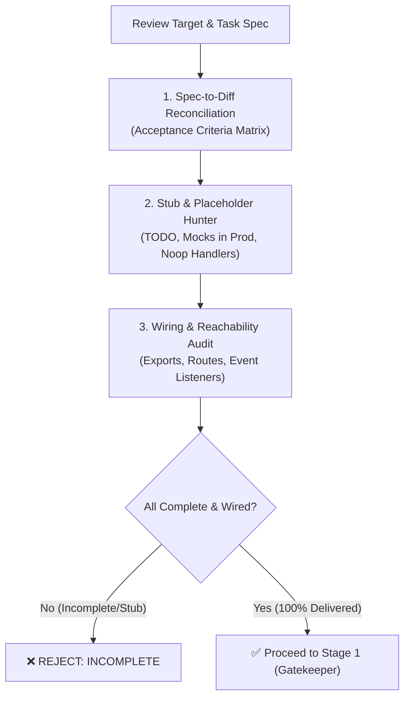

# Stage 0: Spec Compliance & Completeness Auditor

This stage acts as the **first defense line** in the review pipeline. Its purpose is to prevent the "Hallucinated Completion Trap" — where a model claims everything is done, but code contains unfinished stubs, missing requirements, or unwired isolated components.



---

## Core Principles & Boundaries

1. **Adversarial Completeness Mindset**:
   - Never assume code is complete just because tests pass or no syntax errors exist.
   - Actively search for what is **missing**, **faked**, or **partially implemented**.
2. **Zero Tolerance for Unfinished Stubs**:
   - Production code must never contain dummy returns (`return nil`, `return {}`, `return []`) acting as placeholders for unwritten business logic.
3. **Fail-Fast**:
   - If any requirement from the prompt/ticket is unaddressed or left as a stub, **REJECT IMMEDIATELY**. Do not waste cycles on downstream stages.

---

## Inspection Protocol

### Step 1: Spec-to-Diff Reconciliation (Task Mapping)

1. **Locate & Load Specification**:
   - Determine active branch/worktree slug:
     ```bash
     BRANCH=$(git rev-parse --abbrev-ref HEAD 2>/dev/null | tr '/' '-' || echo "current")
     ```
   - If `.agents/specs/${BRANCH}.md` exists, load its **Acceptance Criteria (AC)** and **Target Files**.
   - If no spec file exists, extract requirements from user prompt, PR description, or commit log.
2. **Map Requirements to Code**:
   - For every AC in the spec, locate the exact file(s) and line numbers in the diff where the logic is implemented.
   - If an AC has no corresponding changes in the diff, mark it as **MISSING**.
   - Verify that all checklist items in `.agents/specs/${BRANCH}.md` are marked `[x]`.

### Step 2: Stub & Placeholder Hunter

Scan the entire diff for fake or half-baked logic:

1. **Comment Markers**:
   - `TODO:`, `FIXME:`, `WIP:`, `TBD:`, `XXX:`, `UNIMPLEMENTED`, `STUB`.
2. **Dummy / Mock Return Values in Production Paths**:
   - Empty error returns without processing: `if err != nil { return nil }` or `catch (e) { /* do nothing */ }`.
   - Hardcoded fake datasets in domain services or stores instead of real API/DB calls.
   - Stubbed functions: `func (...) (...) { return nil }` or `const doAction = () => {}`.
3. **Noop Event Handlers & Empty UI Callbacks**:
   - Event bindings pointing at empty handlers.
   - Buttons, menu items, or modals that render without backing actions.

### Step 3: Wiring & Reachability Audit (Anti-Orphan Code)

Ensure that all newly introduced code is reachable and integrated:

1. **Module Exports & Barrel Files**:
   - Are new components, composables, types, and utilities exported from their local `index.ts` and root `src/index.ts`?
2. **Router & Navigation Registration**:
   - If a new page or view is created, is it reachable through the router?
   - Is there navigation/links leading to it?
3. **Service & Dependency Injection**:
   - Are new transport handlers registered with the framework, and are new services actually consumed by something?
   - Are new stores/composables invoked by a component that renders?
4. **Data Migrations & Schema Sync**:
   - If the schema changed, is there a migration, and is it picked up by the runner?

---

## Output Integration

All findings from this stage must be integrated into **Stage 0 (Spec Compliance & Completeness)** of the Unified Review Report in [`../SKILL.md`](../SKILL.md).

If any requirement is missing or stubbed:
- Mark Verdict as `❌ REJECTED` or `⚠️ INCOMPLETE`.
- List exact missing items and stub locations.
