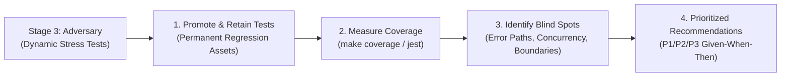

# Stage 4: Test Gap Analyst & Coverage Strategy

This stage formalizes the test strategy following dynamic stress verification. The Test Gap Analyst ensures that:
1. **Tests are Never Lost**: Dynamic stress tests authored in Stage 3 (`adversary`) are permanently retained in the codebase as regression assets.
2. **Coverage is Empirically Measured**: Coverage tooling (`make test`, `jest --coverage`) measures statement and branch coverage across modified packages.
3. **Blind Spots are Systematically Identified**: Uncovered error handling paths, boundary conditions, race windows, and schema drift risks are uncovered.
4. **Actionable Test Expansion is Prescribed**: Clear, prioritized test scenarios (*Given -> When -> Then*) are provided to guide future hardening.



---

## Step 1: Promote & Retain Stage 3 Adversarial Tests

- Review all `.spec.ts` files created or modified during Stage 3.
- Verify that every passing stress test remains in the repository as a permanent test asset.
- Any test that exposed a bug must remain committed as a regression test once the underlying fix is in place.

---

## Step 2: Measure Statement & Branch Coverage

Run the workspace coverage target:
```bash
# Full workspace Go coverage report
make coverage

# Frontend coverage report
npm --prefix modules run test
```

Inspect statement coverage for all packages touched by the pull request or commit diff:
- Calculate the statement coverage percentage for affected modules.
- Identify functions or branches with zero or low coverage.

---

## Step 3: Coverage Gap Analysis (Blind Spot Taxonomy)

Systematically scan the `git diff` for the following 5 vulnerability categories:

1. **Error Path & Fault Injection (Сбои и ошибки)**:
   - Untested `if err != nil` branches, database busy/locked states, missing file/directory errors, context deadline expirations (`context.Canceled`, `context.DeadlineExceeded`).
2. **Boundary & Malformed Inputs (Граничные значения и поврежденные данные)**:
   - Zero-length inputs, oversized inputs (>10k lines), invalid JSON/YAML, unexpected tokens, malformed AST nodes.
3. **Concurrency & Race Conditions (Многопоточность и гонки)**:
   - Concurrent requests mutating the same row, transaction interleaving, repeated OTP submission before the first resolves.
4. **Wire Contract & Type Drift (Контракты и типизация)**:
   - Go `omitempty` / `nil` vs TypeScript `undefined` / `null` mismatches, optional tool argument defaults in MCP.
5. **Property-Based / Invariants (Инварианты)**:
   - Roundtrip encoding/decoding, idempotent indexing (re-indexing yields identical database state).

---

## Step 4: Output Formatting in Unified Review Report

Format the findings as a structured Markdown table in **Stage 4** of the Unified Review Report:

```markdown
## 🧪 Stage 4: Test Gap Analysis & Recommended Test Expansion

**Current Diff Coverage**: `XX.X% statements` across modified packages.

| Priority | Category | Target Component | Proposed Test Scenario (*Given -> When -> Then*) |
| :---: | :--- | :--- | :--- |
| **P1** | Concurrency | `edu/services/school-creation.service.ts` | **Given** two concurrent create requests for the same slug.<br>**When** both pass the uniqueness check before either commits.<br>**Then** exactly one succeeds and the other surfaces a conflict, not a 500. |
| **P2** | Error Path | `shared/services/redis.service.ts` | **Given** Redis is unreachable.<br>**When** a token revocation check runs.<br>**Then** the request fails closed with a clean error rather than treating the token as valid. |
```
