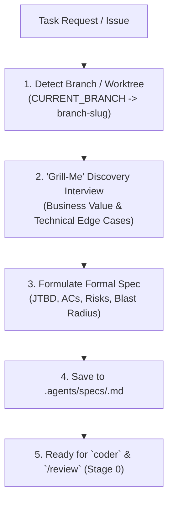

# Specification Skill (`/spec`)

This skill orchestrates the **Specification-Driven Development (SDD)** workflow in Vidya. Before writing code, `/spec` transforms requirements into a structured, persistent, and verifiable specification file located at `.agents/specs/<branch-slug>.md`.



---

## Specification Protocol

### Step 1: Branch & Spec Path Resolution

1. Determine repository root and active branch:
   ```bash
   REPO_ROOT=$(git rev-parse --show-toplevel 2>/dev/null || readlink -f .agents/.. 2>/dev/null || echo "$PWD")
   BRANCH=$(git -C "$REPO_ROOT" rev-parse --abbrev-ref HEAD 2>/dev/null | tr '/' '-' || echo "current")
   ```
2. Set target spec path:
   ```bash
   SPEC_FILE="$REPO_ROOT/.agents/specs/${BRANCH}.md"
   ```

---

### Step 2: Interactive "Grill-Me" Discovery & Interview

Before drafting the specification, the agent MUST actively probe the user's requirements from two complementary angles: **Business & Product Value (Why & What)** and **Technical Resilience (How & What-If)** using the `ask_question` tool:

#### Track A: Business Context & Product Discovery (JTBD & Working Backwards)
1. **Root Pain & Trigger**:
   - *What specific situation triggers this need for the user?*
   - *How is the user solving or working around this today (e.g. manual refresh, terminal parsing, copy-paste)?*
2. **The 80/20 Rule & Avoiding the "XY Problem"**:
   - *Is there a simpler, zero-UI or automated approach that solves 80% of the friction without adding settings/modals?*
   - *What is the leanest default behavior that delivers immediate value?*
3. **User Experience & Mental Model**:
   - *How will the user discover this capability (hotkey, icon, banner, tooltip)?*
   - *What feedback indicates in-progress, success, empty, and failure states?*
4. **Success Verification**:
   - *How do we objectively observe that the user's workflow was improved?*

#### Track B: Technical Edge Cases & Failure Modes (Resilience Engineering)
1. **Boundary & Extreme Conditions**:
   - *How does the system behave on empty (`""`, `[]`, `nil`), oversized (>10k lines), unicode, or malformed data?*
2. **Concurrency & Race Conditions**:
   - *What if the user clicks rapidly or enters keystrokes faster than network resolution? (Abort in-flight, debounce, or queue?)*
3. **Failure Degradation & Wire Contracts**:
   - *What happens offline — when the device holds a stale token, or the outbox cannot reach the server?*
   - *Do both sides of the wire contract still agree, including optional and nullable fields?*
4. **Scope Boundaries & Non-Goals**:
   - *What adjacent code, legacy components, or speculative features are strictly OUT of scope?*

#### Execute Interactive Q&A (`ask_question`):
- Present structured multiple-choice questions (prefix recommended option with `(Recommended)`).
- Proceed only when both business intent and technical trade-offs are locked in.

---

### Step 3: Task Deconstruction & Boundary Analysis

Once interview answers are collected:
1. **Define Scope Guardrails**:
   - **Goal**: Exactly what value is delivered.
   - **Non-Goals**: Explicit boundaries of what will NOT be changed (Anti-Rabbit-Holes).
2. **Map Blast Radius**:
   - Identify all files requiring creation, modification, or deletion.

---

### Step 4: Author the Specification Document

Populate `.agents/specs/${BRANCH}.md` following the standardized structure in [`.agents/specs/TEMPLATE.md`](../../specs/TEMPLATE.md):

1. **Header**: Branch slug, status (`IN_PROGRESS`), target modules.
2. **Section 1: Business Context & User Value (JTBD)**: Problem statement, current workaround, before/after user journey, success criteria.
3. **Section 2: Goals, Non-Goals & Scope Guardrails**: Primary deliverables and strict out-of-scope boundaries.
4. **Section 3: Observable Acceptance Criteria (AC)**: Concrete, verifiable facts (status codes, DOM elements, invariants).
5. **Section 4: Technical Risks, Failure Modes & Edge Cases**: Risk matrix with specific code mitigations.
6. **Section 5: Blast Radius & Target Files**: Table of affected files with explicit actions.
7. **Section 6: Phased Execution Plan**:
   - **Phase 1 (Red Phase)**: Author failing test and verify non-zero exit code.
   - **Phase 2 (Implementation / Green Phase)**: Implement logic until test passes.
   - **Phase 3 (Wiring / Integration Phase)**: Re-export from `index.ts`, register routes/handlers, wire UI bindings.
   - **Phase 4 (Gatekeeper)**: Remove all `TODO` / stubs, run quality gates.
8. **Section 7: Verification Gate**: Exact CLI command line for final validation.

---

### Step 5: Downstream Integration

Once the spec file is written:
1. **`coder` Agent**: Consumes `.agents/specs/<branch-slug>.md`, executing steps sequentially and updating checkboxes to `[x]`.
2. **`/review` Agent**: Stage 0 ([`0-completeness.md`](../review/stages/0-completeness.md)) reads the spec file to verify that 100% of Acceptance Criteria and checklist items are delivered in the diff.
