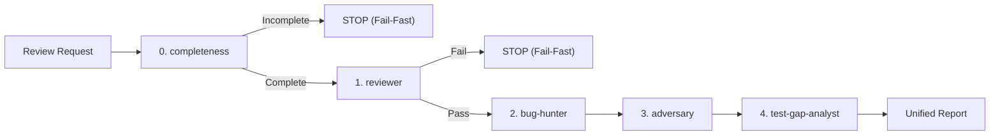

# Vidya Agent System & Development Guide

Welcome to Vidya. All AI coding agents operating on this repository must adhere to the rules and skills defined here.

Vidya is a Learning Management System: a NestJS API, a TypeORM schema, and Vue
clients for school administration and students, in one npm-workspace monorepo.

## Quick Navigation

- **Architecture Guidelines**: [`.agents/rules/architecture.md`](./.agents/rules/architecture.md)
- **Backend Coding Style (NestJS)**: [`.agents/rules/coding-style-backend.md`](./.agents/rules/coding-style-backend.md)
- **Frontend Coding Style (Vue)**: [`.agents/rules/coding-style-frontend.md`](./.agents/rules/coding-style-frontend.md)
- **Comments & Docblocks**: [`.agents/rules/comments.md`](./.agents/rules/comments.md)
- **Specification Skill (`/spec`)**: [`.agents/skills/spec/SKILL.md`](./.agents/skills/spec/SKILL.md)
- **Unified Review Skill (`/review`)**: [`.agents/skills/review/SKILL.md`](./.agents/skills/review/SKILL.md)
- **Coder Agent Skill**: [`.agents/skills/coder/SKILL.md`](./.agents/skills/coder/SKILL.md)
- **Makefile Skill**: [`.agents/skills/makefile/SKILL.md`](./.agents/skills/makefile/SKILL.md)

---

## Skills describe method, rules describe this project

`.agents/skills/` holds workflows that carry across repositories — how to spec a
task, how to implement one, how to review a diff. They name no framework and no
tool, and they read the project's constraints instead of restating them.

`.agents/rules/` holds everything specific to Vidya — the layout, the layering,
the coding styles. When a convention changes, it changes here, in one place, and
every skill picks it up.

A skill that mentions a library belongs in the rules. A rule that explains a
workflow belongs in a skill.

---

## Repository Layout

```text
modules/
├── libs/       domain, entities, protocol   # no transport, no deployment
├── apps/       admin, mobile                # user-facing clients (greenfield)
└── services/   api, database, gateway, seeder
```

Libs never depend on apps or services. Cross-package imports use `@vidya/*`,
never a relative path that climbs out of the package.

---

## Core Principles for Agents

1. **Size Limits & Decomposition**:
   - Total file <= 350 lines (blanks and comments excluded).
   - Vue: `<template>` <= 100 lines, `<script>` <= 300 lines, template depth <= 4.
   - Decompose early rather than refactoring at the ceiling.
2. **Complexity Limits**:
   - Cyclomatic complexity <= 10 per function; control-flow nesting <= 3 levels.
   - Past the limit, use dispatch tables, lookup maps, or guard clauses — not a bigger limit.
3. **Layer Discipline (NestJS)**:
   - Controllers parse and dispatch. Domain services hold logic and never touch HTTP.
   - A controller never returns a TypeORM entity; map to a DTO.
   - One service, one bounded context. Compose across domains in the controller.
4. **Determinism in Pure Layers**:
   - No `Date.now()`, `new Date()`, `setTimeout`, `setInterval`, `Math.random()` in `libs/`.
     Inject a port. Security-sensitive values come from `crypto`, never `Math.random()`.
5. **No Swallowed Errors**:
   - Empty `catch` blocks fail lint. Handle, rethrow, log, or comment why it is safe.
6. **Template Purity (Vue)**:
   - No nested ternaries in templates, no logic in event handlers, no `querySelector`
     for state, no monolithic class strings.
7. **Prettier Integrity**:
   - `semi: false`, `singleQuote: true`, `printWidth: 100`, `trailingComma: 'all'`.
     Never hand-format around Prettier.
8. **Mandatory Gatekeeper**:
   - Always run `make check` from the repository root before marking any coding task
     complete. It chains `typecheck` (`tsc --noEmit`), `lint` (ESLint flat config),
     `format:check` (Prettier) and `test` (Jest) across every workspace.
   - A partial gate is not a gate. `make lint` alone proves nothing about types,
     formatting, or behaviour.

---

## Specification-Driven Development

Before implementing a non-trivial task, author a spec with
[`/spec`](./.agents/skills/spec/SKILL.md). It interviews you on business intent
and failure modes, then writes `.agents/specs/<branch-slug>.md` from
[`.agents/specs/TEMPLATE.md`](./.agents/specs/TEMPLATE.md) with observable
acceptance criteria, a blast radius, a phased plan and a verification gate.

The spec is the contract downstream: `coder` executes it and ticks the boxes,
and Stage 0 of `/review` rejects the diff if any criterion is undelivered.

---

## Code Review Protocol: The 4-Agent Review Pipeline (`/review`)

When requested to review code or pull requests (e.g. via `/review`), the lead agent executes the unified pipeline defined in [`.agents/skills/review/SKILL.md`](./.agents/skills/review/SKILL.md):



0. **Stage 0: Spec Compliance & Completeness**:
   - Guide: [`.agents/skills/review/stages/0-completeness.md`](./.agents/skills/review/stages/0-completeness.md)
   - Reconcile the diff against the spec's acceptance criteria, hunt stubs and
     placeholders, verify new code is actually wired and reachable.
   - **Fail-Fast**: reject before spending cycles on the later stages.
1. **Stage 1: Gatekeeper & Architecture**:
   - Guide: [`.agents/skills/review/stages/1-gatekeeper.md`](./.agents/skills/review/stages/1-gatekeeper.md)
   - Run `make check` (`tsc`, `eslint`, `prettier`, `jest`).
   - Audit layer boundaries, package dependency direction, and structural limits.
   - **Fail-Fast**: Stop and reject immediately if compilation, lint, or tests fail.
2. **Stage 2: Semantic Logic Audit**:
   - Guide: [`.agents/skills/review/stages/2-bughunter.md`](./.agents/skills/review/stages/2-bughunter.md)
   - Inspect `git diff` and blast radius.
   - Check async races, permission algebra, boundary errors, and wire contracts.
   - Formulate concrete failure scenarios (*Given -> When -> Then*).
3. **Stage 3: Dynamic Stress Verification & Promoted Tests**:
   - Guide: [`.agents/skills/review/stages/3-adversary.md`](./.agents/skills/review/stages/3-adversary.md)
   - Write targeted `.spec.ts` cases for suspected edge cases and run them.
   - All passing and bug-reproducing tests are permanently promoted into the repository test suite.
4. **Stage 4: Test Gap Analysis & Coverage Strategy**:
   - Guide: [`.agents/skills/review/stages/4-test-gap-analyst.md`](./.agents/skills/review/stages/4-test-gap-analyst.md)
   - Measure coverage (`make test`, `jest --coverage`).
   - Identify blind spots (uncovered error paths, boundary conditions, races, wire drift).
   - Formulate prioritized test expansion recommendations (P1/P2/P3 with *Given -> When -> Then*).
5. **Synthesis**: Output the standardized Unified Review Report strictly adhering to the template in [`.agents/skills/review/SKILL.md`](./.agents/skills/review/SKILL.md) with zero format deviations.
