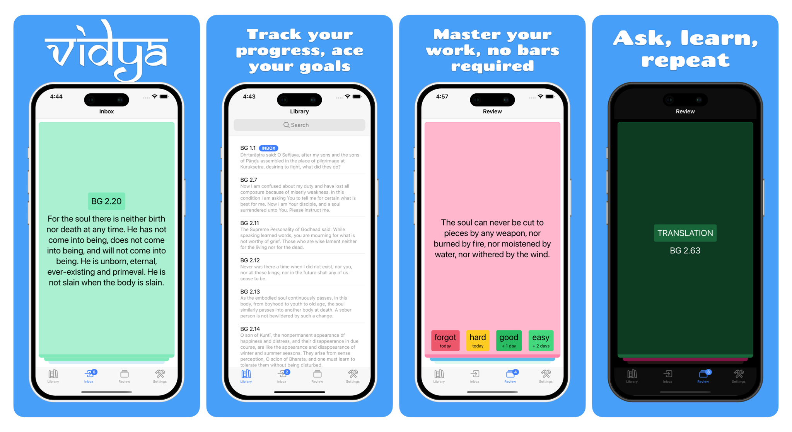

<p align="center">
  
</p>

<p align="center"><i>
Vidya is a Learning Management System (LMS) crafted to revolutionize education by enabling you to establish and manage your own schools, complete with students, teachers, and more. It empowers students with the flexibility to learn anytime, anywhere through a state-of-the-art mobile application.
</i></p>

<p align="center">
  <a href="#">
    
  </a>
  <a href="#">
    
  </a>
  <a href="#">
    
  </a>
</p>

## Features

1. 🏫 **School Management Made Easy** Open and manage your own school. Invite students, onboard teachers, and handle everything from one dashboard.

2. 📚 **Course Creation** Build structured courses with lessons and homework. Organize your curriculum exactly the way you want.

3. 🌐 **Multi-Platform Access**
Students can join your school via a user-friendly website or mobile app — learning made simple and accessible.

4. 🛠️ **Your Brand, Your Domain**
Want a fully branded school on your custom domain? Need a dedicated mobile app? No problem — Vidya generates it for you automatically.

## Get involved
If you'd like to help develop the project, here's a list of links to get you started:

1. [Development Environment](<docs/Development Environment.md>) – Configure your development enviroment to get started.
2. [Good First Issues](https://github.com/jiva-studio/vidya/issues?q=is%3Aissue+is%3Aopen+label%3A%22good+first+issue%22) – a list of simple issues any developer could start from.
3. [Roadmap](https://github.com/orgs/akdasa-studios/projects/13/views/4) - list of tasks we are working on.

## Repository Structure

```text
modules/
├── libs/       domain, entities, protocol   # reusable, no transport or deployment
├── apps/       admin, mobile                # user-facing clients
└── services/   api, database, gateway, seeder
```

Libs never depend on apps or services. Cross-package imports use the `@vidya/*`
specifiers declared in `modules/tsconfig.base.json`.

## Development

```bash
make install              # install workspace dependencies
```

### The gate

`make check` is the gate: typecheck, lint, format-check and test over every
workspace. It is what CI runs, and a branch is not done until it exits 0.

```bash
make check                        # every workspace — required before merging
make check-package PKG=@vidya/api # the same four stages, one workspace
```

`check-package` is the inner loop, not a substitute. A package's own tests say
nothing about the packages that import it, so the full gate still has to run
before the branch is handed over.

Individual stages, workspace-wide:

```bash
make typecheck            # tsc --noEmit across every workspace
make lint                 # ESLint (structural limits, purity rules, import order)
make lint-fix             # autofix what ESLint can
make format               # Prettier
make format-check         # Prettier, read-only
make test                 # every suite, backed by pg-mem
```

Narrower:

```bash
make test-package PKG=@vidya/api ARGS='--testPathPattern edu'
```

### Tests against a real database

The default suite runs on pg-mem, which is fast but is not Postgres: it has one
session and stubs advisory locking out.

```bash
make test-postgres-required  # only the suites a real database is required for
make test-postgres           # every suite, with real Postgres behind it
```

`test-postgres-required` runs the `*.postgres.spec.ts` suites — the ones that
skip themselves under pg-mem and therefore prove nothing there. It is quick and
belongs on every branch that touches the schema or the migration runner.
`test-postgres` is broader and slower; run it by hand or on a schedule.

Neither falls back to pg-mem when no server is reachable: they stop and say so,
because a silent fallback reports a pass for suites that never ran.

Each checkout derives its own test database name, so several worktrees can share
one Postgres server without dropping each other's schema. `make db-testdb-drop`
reclaims the databases of checkouts that no longer exist.

### Mutation testing

Coverage says a line ran. Mutation testing says the suite would have noticed if
the line were wrong.

```bash
make mutate-diff PKG=@vidya/api   # only the files this branch changed
make mutate-full PKG=@vidya/api   # the whole package — hours; run it locally
```

Both run incrementally against the baseline committed in `.stryker/incremental/`,
so a branch is scored against what main produced rather than from zero.

Mind what this costs: each mutant re-runs the package's suite, so on a machine shared with other worktrees the run stops converging — suites start timing out at 60 seconds and the report reads like a wall of defects that are nothing but load. Score the diff once, when the branch is otherwise green and the machine is quiet, rather than per change, and never from inside parallel work, where the runs contend with each other and with the very suites they are measuring.

### Service and database

```bash
make api-run              # start the API in watch mode
make api-test             # Jest for the API only

make db-start             # start Postgres
make db-migrate           # apply migrations
make db-schema-drop       # drop the development schema
make db-testdb-drop       # drop the databases the test suite created
make seed                 # populate development data
```

## Working with AI agents

Conventions that coding agents must follow live in [`AGENTS.md`](./AGENTS.md) and
[`.agents/`](./.agents):

- [`.agents/rules/architecture.md`](./.agents/rules/architecture.md) — monorepo layout, layering, dependency rules
- [`.agents/rules/coding-style-backend.md`](./.agents/rules/coding-style-backend.md) — NestJS and TypeScript conventions
- [`.agents/rules/coding-style-frontend.md`](./.agents/rules/coding-style-frontend.md) — Vue component conventions
- [`.agents/rules/comments.md`](./.agents/rules/comments.md) — what a comment may say, and how long it may be
- [`.agents/rules/process.md`](./.agents/rules/process.md) — roles, file ownership and evidence when several agents share a branch
- [`.agents/skills/`](./.agents/skills) — the coder, makefile and 4-stage review workflows
