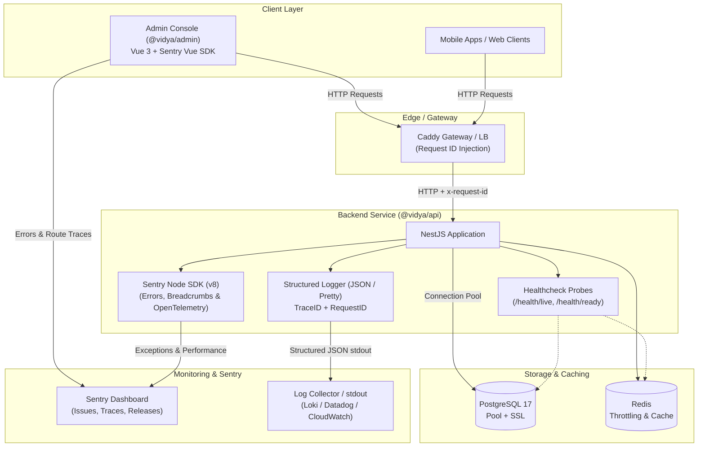

# Observability and Production Readiness

This document describes the observability, structured logging, distributed tracing, Sentry error reporting, and production infrastructure configurations for Vidya.



---

## 1. Structured Logging

In production, `@vidya/api` logs standard structured JSON lines to `stdout` (`stderr` for errors), while in development mode it outputs colorized, human-readable lines.

### Features
- **JSON format in production**: Every entry includes `timestamp`, `level`, `context`, `message`, `trace_id`, `span_id`, `request_id`, and optional metadata.
- **Request Tracking**: Every HTTP request is assigned a unique `request_id` (read from `x-request-id` header or generated as UUID) returned in the response headers.
- **Access Logging**: Logs incoming requests with method, path, HTTP status, execution latency (`durationMs`), client IP, and User-Agent.

### Configuration
```bash
VIDYA_LOG_LEVEL=info    # debug | info | warn | error (default: info in prod, debug in dev)
VIDYA_LOG_FORMAT=json   # json | pretty (default: json in prod, pretty in dev)
```

---

## 2. Sentry Error Tracking & OpenTelemetry

Sentry provides error monitoring, exception reporting, and distributed tracing. The SDK is powered by OpenTelemetry natively.

### Backend API (`@vidya/api`)
- Catches all unhandled exceptions and 5xx errors via `SentryExceptionFilter`.
- Attaches request route, HTTP method, request ID, and authenticated user context (`userId`, `schoolId`).
- Returns safe 500 error responses to clients without exposing internal SQL errors or stack traces.

### Admin Panel (`@vidya/admin`)
- Captures Vue 3 component render errors and unhandled promise rejections.
- Traces client-side page transitions via Vue Router.
- Attaches signed-in operator ID and school ID to the Sentry scope; clears context upon sign-out.

### Sentry Configuration
```bash
# Backend (@vidya/api)
VIDYA_SENTRY_DSN=https://<key>@o<org>.ingest.sentry.io/<project-api>
VIDYA_SENTRY_ENVIRONMENT=production
VIDYA_SENTRY_RELEASE=v1.0.0
VIDYA_SENTRY_TRACES_SAMPLE_RATE=0.1

# Frontend Admin (@vidya/admin - passed during build / container start)
VITE_SENTRY_DSN=https://<key>@o<org>.ingest.sentry.io/<project-admin>
VITE_ENVIRONMENT=production
VITE_APP_VERSION=v1.0.0
VITE_SENTRY_TRACES_SAMPLE_RATE=0.1
```

> **Note**: If `VIDYA_SENTRY_DSN` or `VITE_SENTRY_DSN` is left empty (e.g. in local development), Sentry operates in safe no-op mode.

---

## 3. Health Checks & Graceful Shutdown

The API exposes standard probe endpoints for Kubernetes, Docker health checks, and load balancers:

- `GET /health/live` — **Liveness probe**: returns HTTP 200 `{ "status": "ok", "uptime": 123.45, "timestamp": "..." }`.
- `GET /health/ready` — **Readiness probe**: executes non-blocking health checks against PostgreSQL (`SELECT 1`) and Redis (`ping`) with a 3-second timeout.
  - Returns HTTP 200 `{ "status": "ok", "checks": { "database": "up", "redis": "up" } }` when all dependencies are reachable.
  - Returns HTTP 503 `{ "status": "down", "checks": { "database": "down", ... } }` if any dependency is unreachable.

Graceful shutdown (`app.enableShutdownHooks()`) is enabled to allow in-flight connections to complete and gracefully close database/Redis pools on `SIGTERM`/`SIGINT`.

---

## 4. Database Connection Pooling & SSL

PostgreSQL connection settings in `db.config.ts` support production pooling and encrypted connections:

```bash
# Connection Pool
VIDYA_DB_POOL_MAX=20                  # Maximum number of pool connections per API instance
VIDYA_DB_POOL_MIN=2                   # Minimum idle connections
VIDYA_DB_IDLE_TIMEOUT_MS=30000        # Milliseconds before idle connection is closed
VIDYA_DB_CONNECTION_TIMEOUT_MS=5000   # Timeout for acquiring a connection

# SSL / TLS Encryption
VIDYA_DB_SSL=true                     # Enable SSL for AWS RDS / Supabase / Cloud SQL
VIDYA_DB_SSL_REJECT_UNAUTHORIZED=true # Verify server certificate
```

---

## 5. Summary of Environment Variables

| Variable | Target | Default | Description |
|---|---|---|---|
| `VIDYA_LOG_LEVEL` | API | `info` (prod) / `debug` (dev) | Minimum log level to output |
| `VIDYA_LOG_FORMAT` | API | `json` (prod) / `pretty` (dev) | Output log formatting |
| `VIDYA_SENTRY_DSN` | API | *(empty)* | Sentry DSN for backend API |
| `VIDYA_SENTRY_ENVIRONMENT` | API | `development` / `NODE_ENV` | Environment tag in Sentry |
| `VIDYA_SENTRY_RELEASE` | API | `0.0.1` / package version | Release tag in Sentry |
| `VIDYA_SENTRY_TRACES_SAMPLE_RATE` | API | `0.1` (prod) / `1.0` (dev) | Performance tracing sample rate |
| `VITE_SENTRY_DSN` | Admin | *(empty)* | Sentry DSN for admin panel |
| `VITE_ENVIRONMENT` | Admin | `production` | Environment tag for admin errors |
| `VIDYA_DB_POOL_MAX` | API | `20` | Max database connections in pool |
| `VIDYA_DB_POOL_MIN` | API | `2` | Min database connections in pool |
| `VIDYA_DB_SSL` | API | `false` | Enable SSL for PostgreSQL |
